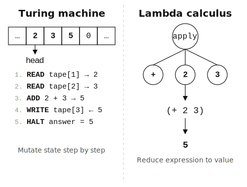

# Two models of computation {#sec-two-models}

```{r}
#| include: false
source(here::here("_common.R"))
```

Once upon a time, four numbers had been left on the table: 3, 5, 2, 8.

Mr. Tape came in through the front door. He was long and thin, and he walked in a straight line from the door to the table. Behind him came Mr. State, who took his place behind Mr. Tape and waited, as he always did. But they were not the only ones there. At the far end of the table someone was already sitting with his hands flat on the surface.

Mr. Tape touched the first number and read it aloud.

"Three."

Mr. State was holding a 3. No one had seen where it came from. On the table, the 3 was still there. He seemed pleased.

Mr. Tape touched the next.

"Five."

Mr. State was holding an 8. The 3 had slipped his mind. He looked at the 8 as though he had always been holding it.

"Two."

He was holding a 10.

"Eight."

He was holding an 18. He could not have told you what he'd had a moment before.

"Eighteen," said Mr. Tape, as was his duty.

The man at the far end of the table had been watching.

"Let's see," said Mr. Fold at last.

Mr. Fold picked up the 2 and the 8. He pressed their edges together and creased them flat. A 10 sat on the table. The 2 and the 8 were gone.

That seemed reasonable.

He folded the 10 into the 5 the same way. Crease and press again. Then the 15 into the 3.

Mr. State stepped forward and picked it up. He turned it over.

It was the same number.


## Instructions and state {#sec-turing}

Before 1936, nobody had a precise answer to a basic question: what does it mean to compute something? Mathematicians could compute; they could describe procedures that produced answers. But no one had pinned down the minimum machinery needed to go from question to answer. A twenty-four-year-old graduate student at Cambridge answered it by imagining the simplest possible machine: a device that reads a symbol from a tape, writes a new one, shifts left or right, and moves to a new internal state. Then it does it again. He proved that this device, given the right set of rules, can carry out any computation that can be precisely described. The graduate student was Alan Turing, who three years later would crack the German military's Enigma cipher in World War II. The machine he imagined is what we now call a computer.

What matters is the picture of computation the tape implies. A Turing machine *does* things: it reads, writes, moves, changes. It has memory (the tape), and that memory changes over time. A program, in this view, is a sequence of instructions that progressively modify stored values until the answer emerges.

Here is what that looks like as pseudocode, for a simple sum of four numbers:

```
total = 0
for each number in [3, 5, 2, 8]:
    total = total + number
return total
```

`total` starts at 0, becomes 3, becomes 8, becomes 10, becomes 18. Mr. Tape read the numbers; Mr. State held the running total, forgetting each previous value the moment the next one arrived. The variable *varies*; the answer lives in its final state. This pattern dominated programming for the next seventy years.

Turing's tape machine was an abstraction, but the first real computers were not far off. ENIAC, built at the University of Pennsylvania, weighed 30 tons, stretched 100 feet long, and filled an entire room. It was programmed by wiring plugboards and flipping switches, one instruction at a time. The language that crystallized this model for a generation of programmers was C, designed by Dennis Ritchie at Bell Labs in the early 1970s. In C, the programmer allocates memory, reads from it, writes to it, and frees it when done. The language does not manage any of this for you. R itself is written in C. And every popular language that followed inherited the same picture, even when they made it friendlier. Python handles memory for you and reads almost like pseudocode, yet underneath, variables are still containers and a program is still a sequence of instructions changing what's inside them. The `for` loop above could be Python with one character changed. JavaScript, created at Netscape (Brendan Eich wrote the first version in ten days), has since become the most widely used programming language in the world. All of them share the same underlying model of what computation is. It dominates so thoroughly that you might assume it's the only one there is.

So is it?

{#fig-turing-vs-church width=100%}

## Expressions and functions {#sec-church}

Alonzo Church, who happened to be Turing's doctoral advisor at Princeton, was working on the same problem at the same time but from a completely different angle. Church built a notation called the *lambda calculus*. It has three things:

1. Variables: `x`
2. Functions: `λx. x + 1` (take `x`, return `x + 1`)
3. Application: `(λx. x + 1)(5)` gives `6`

There is no tape, no memory, no state that changes over time. You write an expression and simplify it by applying functions to arguments until you reach a value that can't be simplified further. Church proved that this system, despite having no concept of memory or instructions, can compute exactly the same class of functions as Turing's machine. The equivalence, known as the Church-Turing thesis, meant that memory and instructions were never necessary for computation in the first place. Everything a Turing machine can do, pure expression can do without a single mutable cell.

What does the same sum look like in this world?

```
sum([3, 5, 2, 8])
= add(3, sum([5, 2, 8]))
= add(3, add(5, sum([2, 8])))
= add(3, add(5, add(2, 8)))
= add(3, add(5, 10))
= add(3, 15)
= 18
```

The expression unfolds, each `add` consuming its arguments, until only 18 remains. This was Mr. Fold's method — no running total, no memory, just pairs collapsing until one number was left. Nothing was overwritten.

Turing's model asks "what sequence of operations transforms my initial state into the answer?" Church's asks a different question entirely: "what expression, when fully evaluated, gives the answer?" The result is the same, but the picture of what happened along the way could hardly be more different. And both pictures show up in real code, in a language you can open right now.


## What this has to do with R {#sec-where-r-fits}

R descends from Church's model. The chain runs through four decades and several languages (@sec-family-tree tells the full story), but the result is visible right now, without knowing any of that history. Compare the *shape* of the code with the two models from earlier.

Suppose you have a list of exam scores and you want to know how many students scored above 70. In the instruction-and-state style, you would create a counter, loop through the scores, and increment each time you find one above the threshold:

```{r}
#| eval: false
scores <- c(65, 82, 71, 90, 55, 78)

count <- 0
for (s in scores) {
  if (s > 70) {
    count <- count + 1
  }
}
count
```

This works, and R can do it. But there is a variable (`count`) that gets modified in a loop, one step at a time. `count` starts at 0, becomes 1, becomes 2, becomes 3, becomes 4. One slate, always overwritten. Here is the same problem in the expression-and-function style:

```{r}
#| eval: false
scores <- c(65, 82, 71, 90, 55, 78)

sum(scores > 70)
```

One line. `scores > 70` produces a vector of `TRUE` and `FALSE` values; `sum()` counts the `TRUE`s. The expression describes the answer, and R evaluates it.

Both give the answer 4. But the second version is shorter, easier to read, and (as you'll learn in @sec-vectors) faster, because R was *designed* for it. The loop version works against the grain; the expression version works with it.

The same pattern runs through the rest of the language:

- `if/else` returns a value, so you can assign its result directly. In most languages, `if` is a statement that *does* something; in R, it's an expression that *produces* something (@sec-expressions-names):

    ```r
    y <- if (x > 0) "positive" else "negative"
    ```
- Functions are ordinary values. You can store one in a variable, pass it to another function, or create one on the fly (@sec-functions-are-values).
- `x * 2` multiplies every element of `x` at once, with no loop and no index variable. Operations that in other languages require a loop are built into R as expressions on whole vectors (@sec-vectors).
- Pipe chains compose functions left to right, each one receiving the result of the previous one. This is Church's core operation, function composition, made into syntax (@sec-pipes-and-composition):

    ```r
    data |> filter(x > 5) |> summarize(mean(y))
    ```

But how did Church's 1936 notation, written decades before computers existed, end up inside a language used by statisticians? @sec-family-tree follows the chain: Church to Lisp to Scheme to S to R, and what each step added along the way.
