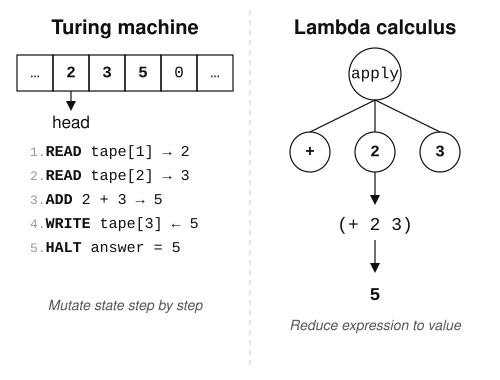

# Two models of computation {#sec-two-models}

```{r}
#| include: false
source(here::here("_common.R"))
```

By 1930, the dream was close. For three centuries, each generation of mathematicians had made precise what the previous one had assumed. First numbers, then inference, and finally proof itself. The goal was a mechanical method to settle any mathematical question: feed in a statement, follow the rules, get the answer.

The greatest living mathematician had spent thirty years organizing this effort into a single program. He needed to show that every true statement had a proof, and that no proof ever led to a contradiction. Establish both, and any question could be settled by turning a crank.

He stood before a packed hall in Königsberg and declared it would be done. *Wir müssen wissen. Wir werden wissen.* We must know. We shall know. His name was David Hilbert\index{Hilbert, David}.

But could the machinery of proof deliver everything Hilbert hoped for? The following year, a twenty-five-year-old logician in Vienna, Kurt Gödel\index{Gödel, Kurt}, showed that even arithmetic contained truths its own rules could not prove.

He had found something the machinery could not touch. Take a consistent formal system whose rules can be mechanically checked and which is rich enough to express basic arithmetic. You can construct a sentence inside it which says, in effect, *I cannot be proved here*. If the system proved it, the system would contradict itself. So the sentence cannot be proved there, and what it says is true. The rules leave a truth beyond their reach.

Add more rules, and the new system has a new such sentence; add more again, and so does that one. As long as the rules remain consistent and mechanically checkable, some true statements about arithmetic will remain beyond their reach. Kurt Gödel had found a boundary nobody knew existed.

But the absence of a proof left a question open. Could a procedure tell us whether to keep searching or stop because no proof existed? To answer that, mathematicians first had to make precise what they meant by a *mechanical procedure*: a sequence of steps that could be followed without thought. What does it mean to compute?\index{computation}

In 1936, two mathematicians gave strikingly different answers. One imagined a machine: a paper tape, a reading head, a finite list of rules. The other described computation using functions, in a language with only three kinds of expression. Their approaches looked nothing alike, yet they turned out to have the same computational reach. Modern computing would inherit both.

***

Once upon a time, four numbers had been left on the table: 3, 5, 2, 8.

Mr. Tape\index{Mr. Tape (allegory)} came in through the front door. He was long and thin, and he walked in a straight line from the door to the table. Behind him came Mr. State\index{Mr. State (allegory)}, who took his place behind Mr. Tape and waited, as he always did. But they were not the only ones there. At the far end of the table someone was already sitting with his hands flat on the surface.

Mr. Tape touched the first number and read it aloud.

"Three."

Mr. State was holding a 3. No one had seen where it came from. On the table, the 3 was still there. He seemed pleased.

Mr. Tape touched the next.

"Five."

Mr. State was holding an 8. The 3 had slipped his mind. He looked at the 8 as though he had always been holding it.

"Two."

He was holding a 10.

"Eight."

He was holding an 18. He could not have told you what he'd had a moment before.

"Eighteen," said Mr. Tape, as was his duty.

The man at the far end of the table had been watching.

"Let's see," said Mr. Fold\index{Mr. Fold (allegory)} at last.

Mr. Fold picked up the 2 and the 8. He pressed their edges together and creased them flat. A 10 sat on the table. The 2 and the 8 were gone.

That seemed reasonable.

He folded the 10 into the 5 the same way. Crease and press again. Then the 15 into the 3.

Mr. State stepped forward and picked it up. He turned it over.

It was the same number.


## Instructions and state {#sec-turing}

Mr. Tape and Mr. State are a computing machine. In 1936, a young mathematician at Cambridge gave their method a precise form: read a symbol, update a state, move to the next. His name was Alan Turing\index{Turing, Alan}. He would help the Allies win the Second World War by breaking German Enigma messages, become known as a father of modern computing, and remain a hero to generations of programmers.

A Turing machine\index{Turing machine} *does* things: it reads, writes, moves, changes. It has memory (the tape), and that memory changes over time. A program, in this view, is a sequence of instructions that progressively modify stored values until the answer emerges.

Here is what that looks like as pseudocode, for a simple sum of four numbers:

```
total = 0
for each number in [3, 5, 2, 8]:
    total = total + number
return total
```

`total` starts at 0, becomes 3, becomes 8, becomes 10, becomes 18. Mr. Tape read the numbers; Mr. State held the running total, forgetting each previous value the moment the next one arrived. The variable *varies*; the answer lives in its final state.

Turing's tape was an abstraction. ENIAC, built a decade later at the University of Pennsylvania, was not. It weighed thirty tons. To program it, you walked between cabinets and rewired plugboards by hand, instruction by instruction, switch by switch, the machine's "memory" a literal physical configuration of cables. Every popular language since has inherited that picture, even when they hid the cables. A variable is still a box. A program is still a sequence of things you do to what's inside it.

So is that what computation *is*?

{#fig-turing-vs-church width=75%}

## Expressions and functions {#sec-church}

Mr. Fold used no tape and kept no state. He pressed numbers together, pair by pair, each pair replaced by its sum and the originals destroyed, until one remained. Written out, his method looks like this:

```
sum([3, 5, 2, 8])
= add(3, sum([5, 2, 8]))
= add(3, add(5, sum([2, 8])))
= add(3, add(5, add(2, 8)))
= add(3, add(5, 10))
= add(3, 15)
= 18
```

The first steps expand `sum`; the next carry out the additions, until only 18 is left. No running total is stored and updated. Each expression\index{expression} is replaced by another. Replacement instead of changing memory, and yet the same answer as Mr. Tape and Mr. State. Can replacement alone match their unlimited reading and rewriting power?

The second of the two 1936 answers came from Princeton, from a logician who would become Turing's doctoral advisor later that year. His name was Alonzo Church\index{Church, Alonzo}. His notation had no tape and no mutable memory. You wrote down an expression, something like `(λx. x + 1)(5)`, and simplified it: substitute `5` for `x`, and what remains is `5 + 1`, or `6`. The numbers and addition are familiar shorthand; underneath, the notation has just three ingredients. It has variables, it has functions (`λx. x + 1` means *take `x`, return `x + 1`*), and it has function application: writing one expression next to another to apply it. Church called it the *lambda calculus*\index{lambda calculus}. Even numbers and arithmetic can be built from those three ingredients.

Turing proved that this tiny grammar can compute exactly the same class of functions as his machine. Everything the machine can do, pure expression can do without a single mutable cell.

Changing stored values was never a requirement for computation.

The Church–Turing thesis\index{Church-Turing thesis} makes a broader claim: anything that can be calculated by a precise mechanical procedure can be computed by either model. Their equivalence is proved. The thesis is the claim that these models capture everything we mean by an effective method of calculation.


## What this has to do with R {#sec-where-r-fits}

R descends from Church's model. The chain runs through several languages (@sec-family-tree tells the full story), but the result is visible right now, without knowing any of that history. Compare the *shape* of the code with the two models from earlier.

Suppose you have a set of exam scores and want to know how many students scored above 70. In the instruction-and-state style, you would create a counter, loop through the scores, and increment it each time you find one above the threshold:

```{r}
#| eval: false
scores <- c(65, 82, 71, 90, 55, 78)

count <- 0
for (s in scores) {
  if (s > 70) {
    count <- count + 1
  }
}
count
```

This works, and R can do it. But there is a variable, `count`, that gets modified in a loop, one step at a time. It starts at 0, becomes 1, becomes 2, becomes 3, becomes 4. One slate, always overwritten. Here is the same problem in the expression-and-function style:

```{r}
#| eval: false
scores <- c(65, 82, 71, 90, 55, 78)

sum(scores > 70)
```

One line. `scores > 70` produces a vector of `TRUE` and `FALSE` values; `sum()` treats these as 1 and 0 and adds them up. One expression produces a value, which becomes the input to another.

Both give the answer 4. In the loop, you keep track of the count as it changes. In the expression, you combine operations that return values. The idea from 1936 is already here, in your first line of R.

The same shape runs through the rest of the language. `if/else` produces a value, so you can assign its result directly:

```r
y <- if (x > 0) "positive" else "negative"
```

`x * 2` multiplies every element of `x` at once, with no loop and no index variable. The expression takes the whole vector as its input.

A function is an ordinary value. `sqrt` on its own, without parentheses, refers to the function itself. You can store it in a variable or hand it to another function.

Pipe chains pass each result into the next function, left to right:

```r
data |> filter(x > 5) |> summarize(mean(y))
```

Read this as: take the data, keep the rows where `x > 5`, then calculate the mean of `y` for those rows.

Each of these gets its own chapter (@sec-expressions-names, @sec-vectors, @sec-functions-are-values, @sec-pipes-and-composition). They share a way of thinking: expressions produce values, functions transform them, and functions can themselves be values. The shape is Mr. Fold's.

But how did Church's notation, devised before the first electronic computers, end up inside a language used by statisticians? @sec-family-tree follows the story through Lisp and Scheme to R, where those ideas met the statistical tradition of S.
