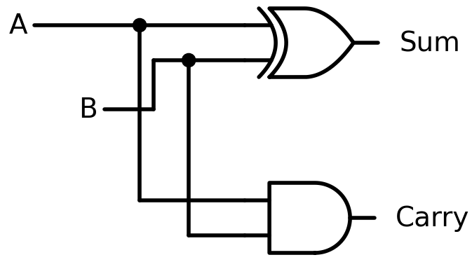
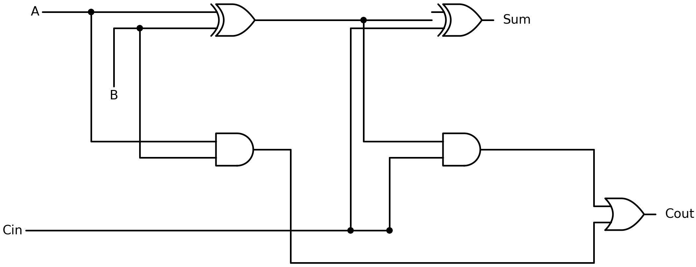

# Logic and control flow {#sec-logic-control-flow}

```{r}
#| include: false
source(here::here("_common.R"))
```

In @sec-coercion, you saw that `TRUE` becomes 1 and `FALSE` becomes 0 when R needs a number. That was a hint. Logical values are not second-class citizens in R; they are a full type with their own operators, and they drive every decision your code makes. This chapter covers logical vectors, comparisons, boolean operators, and `if/else`. In R, `if/else` is an expression that returns a value, not a statement that directs traffic.


## Logical vectors {#sec-logical-vectors}

`TRUE` and `FALSE` are R's logical values. You already met them in @sec-atomic-vectors as one of the four main types (double, integer, character, logical).

```{r}
x <- c(TRUE, FALSE, TRUE, TRUE, FALSE)
typeof(x)
length(x)
```

Logical vectors are the result of every comparison, every filter, every conditional check. `sum(x > 5)` works because `x > 5` produces a logical vector and `sum()` coerces `TRUE` to 1, `FALSE` to 0 (@sec-coercion).

A logical value is one of exactly two things: `TRUE` or `FALSE`. There is no third option. In type theory, this is a *sum type* (also called a tagged union or variant): a type defined by listing its variants. `Bool = TRUE | FALSE`. A data frame row combines fields with AND (a penguin has a species AND a mass AND a flipper length); a sum type chooses one variant with OR. You will see sum types again when factors define a fixed set of levels (@sec-why-factors) and when S3 dispatch selects a method based on class (@sec-s3-basics). Where product types (like data frames) say 'all of these together,' sum types say 'exactly one of these.'

R also has `T` and `F` as shortcuts for `TRUE` and `FALSE`. Do not use them.

```{r}
T <- 42
T
```

```{r}
rm(T)
```

`T` is a regular variable name; you can overwrite it. `TRUE` is a reserved word; you cannot. Code that relies on `T` meaning `TRUE` will break silently the moment someone (or some package) assigns to `T`. The same applies to `F`.

::: callout-tip
## Opinion
Never use `T` and `F`. Always write `TRUE` and `FALSE` in full. It costs a few keystrokes and prevents a class of bugs that are painful to track down.
:::


### Exercises {.unnumbered}

1. What does `sum(c(TRUE, FALSE, TRUE, FALSE, TRUE))` return? Why?
2. What is `typeof(TRUE)`? What about `typeof(T)` (before any assignment)?
3. Try `TRUE <- 42`. What happens?


## Comparison operators {#sec-comparison-operators}

Six operators compare values:

```{r}
3 == 3
3 != 4
3 < 5
3 > 5
3 <= 3
3 >= 4
```

All six are vectorized:

```{r}
x <- c(1, 5, 3, 8, 2)
x > 3
```

Five values in, five logical values out. This is the same vectorization from @sec-vectorized-ops, applied to comparisons.

`%in%` tests membership in a set:

```{r}
x <- c("cat", "dog", "bird", "cat")
x %in% c("cat", "bird")
```

`%in%` is cleaner than chaining `==` with `|`. Compare `x == "cat" | x == "bird"` to `x %in% c("cat", "bird")`. They produce the same result, but `%in%` scales to larger sets without the repetition.

One trap deserves early mention: floating-point comparison.

```{r}
0.1 + 0.2 == 0.3
```

This returns `FALSE` because computers store numbers in binary, and most decimal fractions have no exact binary representation (the same way 1/3 has no exact decimal representation). The stored values of `0.1 + 0.2` and `0.3` differ by about `5.6e-17`. Use `all.equal()` for approximate comparison:

```{r}
all.equal(0.1 + 0.2, 0.3)
```

@sec-numerical-computing covers floating-point arithmetic in depth, including catastrophic cancellation, condition numbers, and log-space arithmetic. For now, the rule is: never use `==` to compare computed decimal numbers.


### Exercises {.unnumbered}

1. What does `c(1, 2, 3) == c(1, 5, 3)` return?
2. Use `%in%` to check which elements of `c("a", "b", "c", "d")` are vowels.
3. What does `0.1 + 0.1 + 0.1 == 0.3` return? Is it the same as `0.1 + 0.2 == 0.3`? Why?


## Boolean operators {#sec-boolean-operators}

Logical values combine with `&` (and), `|` (or), and `!` (not):

```{r}
TRUE & FALSE
TRUE | FALSE
!TRUE
```

These are vectorized, like arithmetic:

```{r}
x <- c(1, 5, 3, 8, 2)
x > 2 & x < 6
```

Each element is tested independently: is it greater than 2 *and* less than 6?

R also has `&&` and `||`, which look similar but behave differently. They examine only the first element and use *short-circuit evaluation*: if the first operand of `&&` is `FALSE`, the second is never evaluated (because the result must be `FALSE` regardless). Similarly, if the first operand of `||` is `TRUE`, the second is skipped.

```{r}
FALSE && stop("this is never reached")
```

No error. `stop()` was never called because `&&` saw `FALSE` on the left and short-circuited.

```{r}
#| error: true
FALSE & stop("this IS reached")
```

`&` evaluated both sides, so `stop()` fired.

::: callout-tip
## Opinion
Use `&` and `|` when working with vectors (filtering data, logical indexing). Use `&&` and `||` inside `if()` conditions, where you have a single logical value and want short-circuit behavior.
:::

`xor()` (exclusive or) returns `TRUE` when exactly one of its arguments is `TRUE`:

```{r}
xor(TRUE, FALSE)
xor(TRUE, TRUE)
```

You won't need `xor()` often, but it exists.


### Exercises {.unnumbered}

1. What does `c(TRUE, FALSE, TRUE) & c(TRUE, TRUE, FALSE)` return?
2. What does `TRUE | stop("error")` do? What about `TRUE || stop("error")`? Explain the difference.
3. Write a logical expression that tests whether `x` is between 10 and 20 (inclusive).


## Logic gates: where code meets hardware {#sec-logic-gates}

You now know R's logical operators well enough to filter data and write conditionals. But these operators did not originate in programming languages; they describe physical reality. The `&` you use to combine filter conditions is the same AND operation that electrical engineers wire into silicon, described by the same truth tables George Boole formalized in 1854 and that Claude Shannon, in his 1937 master's thesis, showed could be implemented with electrical switches. Understanding this connection, from the code you write to the circuits that execute it, reveals why Boolean algebra is not just a convenience but the foundation on which all digital computation is built.

The `&`, `|`, `!`, and `xor()` you just learned are physical operations, implemented as tiny circuits called *logic gates* inside every processor.

An AND gate has two input wires and one output wire. The output is 1 (high voltage) only when both inputs are 1. An OR gate outputs 1 when at least one input is 1. A NOT gate (also called an inverter) has one input and flips it: 1 becomes 0, 0 becomes 1. An XOR gate outputs 1 when the inputs differ.

```
AND gate         OR gate          XOR gate         NOT gate
A  B  out        A  B  out        A  B  out        A  out
0  0   0         0  0   0         0  0   0         0   1
0  1   0         0  1   1         0  1   1         1   0
1  0   0         1  0   1         1  0   1
1  1   1         1  1   1         1  1   0
```

These are the same truth tables as R's `&`, `|`, `xor()`, and `!`. When you write `TRUE & FALSE` in R, the CPU evaluates it using an AND gate (or a chain of them, for vectors). The logic you write in R and the logic etched into silicon are the same logic, described by the same truth tables, separated only by layers of translation.

Everything a computer does, from adding numbers to rendering video, is built from combinations of these four gates. To see how, let's design a circuit the way electrical engineers do: start with inputs and outputs, build a truth table, find the minimal Boolean expression, then wire the gates.


### Designing a half adder {#sec-half-adder}

The simplest addition: two single bits, A and B. Two outputs: a sum bit and a carry bit (because 1 + 1 = 10 in binary, which is 0 with a carry of 1).

**Step 1: truth table.** List every possible input combination and the desired output.

```
A  B  | Sum  Carry
0  0  |  0     0
0  1  |  1     0
1  0  |  1     0
1  1  |  0     1
```

**Step 2: Boolean expression.** For each output, read off the rows where it equals 1. Write each row as a product (AND) of the inputs, using NOT for 0s. Then combine the rows with OR. This is called the *sum of minterms*, the canonical form for any Boolean function:

```
Sum   = (NOT A AND B) OR (A AND NOT B)
Carry = A AND B
```

`Sum` is 1 in two rows: when A=0, B=1 (that's NOT A AND B) and when A=1, B=0 (that's A AND NOT B).

**Step 3: minimize.** The canonical form is correct but not always efficient. Can we simplify? Look at `Sum`: it is 1 when A and B differ. That is the definition of XOR. So:

```
Sum   = A XOR B
Carry = A AND B
```

Two gates. This is a *half adder*:

{#fig-half-adder fig-alt="Circuit diagram of a half adder showing one XOR gate producing Sum and one AND gate producing Carry, with inputs A and B."}

We can verify this in R. R's `&`, `|`, `!`, and `xor()` are the same Boolean operations:

```{r}
half_adder <- function(A, B) {
  list(Sum = xor(A, B), Carry = A & B)
}

half_adder(FALSE, FALSE)
half_adder(TRUE, FALSE)
half_adder(TRUE, TRUE)
```

`TRUE + TRUE` gives Sum = FALSE (0), Carry = TRUE (1). That's binary 10: the number 2. Correct.


### From half adder to full adder {#sec-full-adder}

Real addition has three inputs, not two. When you add column by column in decimal, you carry from the previous column. Binary works the same way. Each column receives A, B, and a carry-in (Cin) from the column to the right.

**Step 1: truth table.** Three inputs, eight rows.

```
A  B  Cin | Sum  Cout
0  0   0  |  0    0
0  0   1  |  1    0
0  1   0  |  1    0
0  1   1  |  0    1
1  0   0  |  1    0
1  0   1  |  0    1
1  1   0  |  0    1
1  1   1  |  1    1
```

**Step 2: sum of minterms.** Read off rows where each output is 1:

```
Sum  = (NOT A AND NOT B AND Cin) OR (NOT A AND B AND NOT Cin)
       OR (A AND NOT B AND NOT Cin) OR (A AND B AND Cin)

Cout = (NOT A AND B AND Cin) OR (A AND NOT B AND Cin)
       OR (A AND B AND NOT Cin) OR (A AND B AND Cin)
```

That's a mess. Four terms per output, each with three variables. Can we simplify?

**Step 3: minimize with a Karnaugh map.** A *Karnaugh map* (K-map) is a visual tool for simplifying Boolean expressions. You arrange the truth table rows in a grid so that adjacent cells differ by exactly one input. Then you look for rectangular groups of 1s: each group of 2, 4, or 8 adjacent 1s can be collapsed into a simpler term.

K-map for Cout, with AB on one axis and Cin on the other:

```
            AB
Cin    00   01   11   10
  0  |  0    0    1    0
  1  |  0    1    1    1
```

Three groups of two 1s: the column AB=11 (group: A AND B, regardless of Cin), the row Cin=1 with B=1 (group: B AND Cin), and the row Cin=1 with A=1 (group: A AND Cin). The minimal expression:

```
Cout = (A AND B) OR (B AND Cin) OR (A AND Cin)
```

That's simpler than the four-term canonical form. For Sum, the K-map shows no adjacent groups (the 1s form a checkerboard), so there's no simplification beyond XOR:

```
Sum = A XOR B XOR Cin
```

**Step 4: build the circuit.** The Sum formula chains two XOR gates. The Cout formula uses two AND gates and one OR gate, but engineers noticed that `(B AND Cin) OR (A AND Cin)` can be rewritten as `((A XOR B) AND Cin)`, because the XOR captures whether exactly one of A, B is 1. The final circuit uses five gates: two XOR, two AND, one OR.

{#fig-full-adder fig-alt="Circuit diagram of a full adder showing two XOR gates, two AND gates, and one OR gate connected with labeled wires for A, B, Cin, Sum, and Cout."}

```{r}
full_adder <- function(A, B, Cin) {
  p <- xor(A, B)              # partial sum (first XOR)
  Sum  <- xor(p, Cin)         # final sum (second XOR)
  Cout <- (A & B) | (p & Cin) # carry-out
  list(Sum = Sum, Carry = Cout)
}

full_adder(TRUE, TRUE, FALSE)  # 1+1+0 = 10 binary
full_adder(TRUE, TRUE, TRUE)   # 1+1+1 = 11 binary
```

1 + 1 + 0 = 2 (binary 10: Sum=0, Carry=1). 1 + 1 + 1 = 3 (binary 11: Sum=1, Carry=1). Correct.

Chain four full adders together (each one's Cout feeding the next one's Cin) and you have a 4-bit adder. Chain 64 of them and you can add two 64-bit numbers. A CPU is billions of these gates arranged to perform arithmetic, comparisons, and memory access. The boolean algebra you use in R to filter data (`penguins$body_mass_g > 4000 & penguins$species == "Gentoo"`) is the same boolean algebra running in the silicon beneath it.

The workflow we just followed (truth table → canonical form → minimize → circuit) is called *Boolean function minimization*. Electrical engineers use it to design every circuit in a processor. K-maps work for up to four or five inputs; for larger circuits, algorithms like Quine-McCluskey or Espresso take over. But the principle is always the same: specify what you want (truth table), then find the smallest set of gates that produces it.


::: callout-note
A logic gate on its own computes one result and stops. Add a clock (an electrical signal that alternates between 0 and 1 at a fixed rate, say 3 billion times per second) and flip-flops (gates that remember their output until the next clock tick), and the circuit can feed its result back into itself as the next input. That is the step from logic to computation: a clock plus a circuit is a calculator. The calculator from @sec-turing that added `3 + 5 + 2 + 8` by keeping a running total? It is an adder circuit driven by a clock, reading one number per tick, feeding the output back into the input. Every processor is this idea, scaled up.
:::


## How numbers are stored {#sec-numbers-stored}

In @sec-atomic-vectors, you saw that R has `double` and `integer` types. The difference matters because of how computers store numbers.

A computer stores everything as bits: 0s and 1s. An integer is stored as a binary number. The integer 42 in binary is `101010`:

```
  1   0   1   0   1   0
 2⁵  2⁴  2³  2²  2¹  2⁰
 32  16   8   4   2   1

 32 + 0 + 8 + 0 + 2 + 0 = 42
```

Each position represents a power of 2. A `1` means "include this power," a `0` means "skip it." R uses 32 bits for an integer, so the largest integer is 2^31^ - 1 = 2,147,483,647 (one bit is reserved for the sign: positive or negative).

```{r}
.Machine$integer.max
```

A double (also called a floating-point number) is stored differently. It uses 64 bits split into three parts: 1 bit for the sign, 11 bits for the exponent, and 52 bits for the fraction (called the significand):

```
 [sign]  [exponent: 11 bits]  [significand: 52 bits]
   1 bit     determines           determines
   +/-       the scale            the precision
```

The number is reconstructed as: ± fraction × 2^exponent^. This format (IEEE 754) can represent very large numbers (up to about 1.8 × 10^308^) and very small ones (down to about 2.2 × 10^-308^), but not all numbers exactly.

```{r}
.Machine$double.xmax
.Machine$double.xmin
```

This is why `0.1 + 0.2 != 0.3` (@sec-comparison-operators). The 52-bit significand stores the closest binary approximation of each decimal number, and when you add two approximations, rounding errors accumulate. @sec-numerical-computing covers these traps in detail, including how to detect them with `sprintf("%.20f", ...)` and how to avoid them with `all.equal()` and `dplyr::near()`.

R defaults to double for all numbers unless you add the `L` suffix:

```{r}
typeof(42)
typeof(42L)
```

`42` is a 64-bit floating-point number. `42L` is a 32-bit integer. For most data analysis, you won't need to think about this distinction. But when you compare computed values with `==`, or when you work with very large counts, the difference between integer and double can produce surprises. @sec-numerical-computing covers this in depth.


## `if/else` as an expression {#sec-if-else-expression}

In most languages, `if/else` is a *statement*: it controls which code runs but doesn't produce a value. In R, `if/else` is an *expression*: it evaluates to the value of whichever branch is taken.

```{r}
x <- -3
y <- if (x > 0) "positive" else "non-positive"
y
```

`if (x > 0) "positive" else "non-positive"` evaluated to `"non-positive"`, and that value was assigned to `y`. This follows from @sec-calling-functions: everything in R is an expression, and expressions return values. `if/else` is no exception.

Multi-line branches use curly braces. The value of each branch is the last expression evaluated inside it:

```{r}
classify <- function(x) {
  if (x > 0) {
    label <- "positive"
    label
  } else if (x == 0) {
    "zero"
  } else {
    "negative"
  }
}

classify(5)
classify(0)
classify(-2)
```

R has no `elif` keyword. You chain conditions with `else if`, which is just an `else` followed by another `if`. Long chains get hard to read; when you have more than two or three branches, consider `switch()` (@sec-switch) or `dplyr::case_when()` (@sec-vectorized-conditionals).

The connection to lambda calculus: in @sec-recursion, we saw Church's encoding of booleans, where `TRUE = λx. λy. x` (pick the first) and `FALSE = λx. λy. y` (pick the second). R's `if/else` does the same thing: it takes a condition and two branches, and returns whichever branch the condition picks. The condition *selects* a value, just as Church's booleans select an argument. The Curry-Howard correspondence takes this further: logical propositions correspond to types, and proofs correspond to programs. Under this lens, `TRUE` and `FALSE` are proof and refutation, and an `if/else` expression is a case analysis on evidence. Typed functional languages like Haskell make this connection explicit; R keeps it implicit, but the structure is the same.

```{r}
#| error: true
if (c(TRUE, FALSE)) "yes"
```

`if` expects a single logical value. If you give it a vector, R uses only the first element and warns you. For element-wise conditionals on vectors, you need `ifelse()` or `dplyr::if_else()`.


### Exercises {.unnumbered}

1. What does `if (TRUE) 1 else 2` return? What about `if (FALSE) 1 else 2`?
2. Write a function `sign_label` that takes a number and returns `"positive"`, `"zero"`, or `"negative"`.
3. What does `if (NA) "yes" else "no"` produce? Why?


## Vectorized conditionals {#sec-vectorized-conditionals}

`if/else` works on a single value. `ifelse()` works on vectors:

```{r}
x <- c(-2, 0, 3, -1, 5)
ifelse(x > 0, "pos", "neg")
```

For each element, `ifelse()` checks the condition and returns the corresponding value from the second or third argument. It is vectorized in the same way `+` and `>` are (@sec-vectorized-ops).

`ifelse()` has a weakness: it doesn't check types.

```{r}
ifelse(TRUE, 1, "no")
ifelse(FALSE, 1, "no")
```

One returns a number, the other a string. The return type depends on which branch is taken, and that can change silently when your data changes. `dplyr::if_else()` is stricter:

```{r}
#| error: true
dplyr::if_else(TRUE, 1, "no")
```

It refuses to mix types. This catches bugs early.

For multiple conditions, `dplyr::case_when()` replaces nested `ifelse()` chains:

```{r}
x <- c(-2, 0, 3, -1, 5)
dplyr::case_when(
  x > 0  ~ "positive",
  x == 0 ~ "zero",
  x < 0  ~ "negative"
)
```

Each line is a condition-value pair. `case_when()` evaluates them in order and returns the value for the first condition that matches. Compare this to the nested version:

```r
ifelse(x > 0, "positive", ifelse(x == 0, "zero", "negative"))
```

Both produce the same result. `case_when()` is easier to read, easier to extend, and harder to get wrong.

::: callout-tip
## Opinion
Prefer `dplyr::case_when()` over nested `ifelse()`. Nested `ifelse()` calls are hard to read and easy to break when you add a condition. `case_when()` scales cleanly to any number of branches.
:::


### Exercises {.unnumbered}

1. Use `ifelse()` to replace negative values in `c(-3, 5, -1, 8, 0)` with zero.
2. Use `dplyr::case_when()` to classify `penguins$body_mass_g` into `"light"` (under 3500), `"medium"` (3500-5000), and `"heavy"` (over 5000). Don't forget `NA`s.
3. What happens if no condition matches in `case_when()`? Test it.


## `switch()` {#sec-switch}

When you need to dispatch on a single string value, `switch()` is cleaner than a chain of `if/else if`:

```{r}
describe <- function(day) {
  switch(day,
    Monday    = "start of the week",
    Friday    = "almost there",
    Saturday  = ,
    Sunday    = "weekend",
    "just another day"
  )
}

describe("Friday")
describe("Saturday")
describe("Wednesday")
```

Each name is matched against the input. `Saturday =` with no value falls through to the next case (`Sunday`), so both return `"weekend"`. The unnamed last entry is the default.

`switch()` only works with a single string (or number, but string dispatch is the common use). For vector operations, use `case_when()`. For complex branching logic, use `if/else if`. `switch()` fills the narrow gap where you have one value and several named options.

