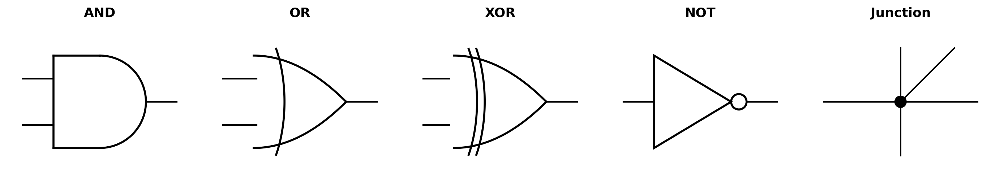
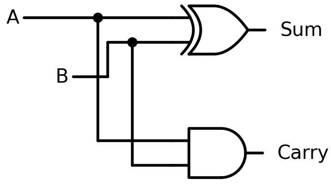
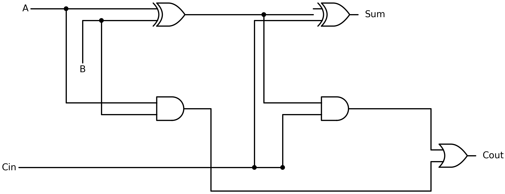

# Logic and control flow {#sec-logic-control-flow}

```{r}
#| include: false
source(here::here("_common.R"))
```

In @sec-coercion, you saw that `TRUE` becomes 1 and `FALSE` becomes 0 when R needs a number. This chapter is about what logical values do before they get coerced: the comparisons that produce them, the operators that combine them, and the `if/else`\index{control flow} that chooses between values based on them.


## Logical vectors {#sec-logical-vectors}

`TRUE` and `FALSE` are R's logical values\index{Boolean}. You already met them in @sec-atomic-vectors as one of the four main types (double, integer, character, logical).

```{r}
x <- c(TRUE, FALSE, TRUE, TRUE, FALSE)
typeof(x)
length(x)
```

Every comparison you write, every filter you apply, every conditional check you run produces one of these vectors. The trick from @sec-coercion is what makes expressions like `sum(x > 5)` work: `x > 5` produces a logical vector, `sum()` coerces `TRUE` to 1 and `FALSE` to 0, and suddenly you are counting how many elements pass the test without writing a single loop.

::: {.callout-note collapse="true"}
## Sum types

In type theory a type defined by listing its variants, `Bool = TRUE | FALSE`, is a *sum type* (also called a tagged union or variant). R's logical type adds `NA` as a third variant for a missing value. Contrast this with a data frame row, which combines fields with AND (a penguin has a species AND a mass AND a flipper length); a sum type chooses one variant with OR. Sum types surface again when factors define a fixed set of levels (@sec-why-factors) and when S3 dispatch selects a method based on class.
:::

R also accepts `T` and `F` as shortcuts. Try assigning to one:

```{r}
T <- 42
T
```

```{r}
rm(T)
```

`T` is a regular variable name, so you can overwrite it with anything, and R will not complain. `TRUE` is a reserved word; `TRUE <- 42` is an error. Code that relies on `T` meaning `TRUE` keeps running after someone (or some package) assigns to `T`, and the same applies to `F`.

::: callout-tip
## Opinion
Never use `T` and `F`. Always write `TRUE` and `FALSE` in full. If someone reassigns `T`, your filter returns the wrong rows and nothing throws an error.
:::


### Exercises {.unnumbered}

1. What does `sum(c(TRUE, FALSE, TRUE, FALSE, TRUE))` return? Why?
2. What is `typeof(TRUE)`? What about `typeof(T)` (before any assignment)?
3. Try `TRUE <- 42`. What happens?


## Comparison operators {#sec-comparison-operators}

Six operators compare values:

```{r}
3 == 3
3 != 4
3 < 5
3 > 5
3 <= 3
3 >= 4
```

All six are vectorized:

```{r}
x <- c(1, 5, 3, 8, 2)
x > 3
```

Five values in, five logical values out, following the same vectorization from @sec-vectorized-ops but applied to comparisons instead of arithmetic.

`%in%` tests membership in a set:

```{r}
x <- c("cat", "dog", "bird", "cat")
x %in% c("cat", "bird")
```

Written out with `==`, that test is `x == "cat" | x == "bird"`, one clause per member; `%in%` stays a single call however large the set grows.

One comparison to keep treating with suspicion:

```{r}
0.1 + 0.2 == 0.3
```

`FALSE`, for the reason you saw in @sec-floating-point-traps: neither side is stored exactly, and `==` detects the difference. `all.equal()` compares with a tolerance:

```{r}
all.equal(0.1 + 0.2, 0.3)
```

Each comparison so far has produced one logical vector. A filter usually needs two tests at once, "heavier than 4 kg *and* on Biscoe island", which means combining two logical vectors into one.


### Exercises {.unnumbered}

1. What does `c(1, 2, 3) == c(1, 5, 3)` return?
2. Use `%in%` to check which elements of `c("a", "b", "c", "d")` are vowels.
3. What does `0.1 + 0.1 + 0.1 == 0.3` return? Is it the same as `0.1 + 0.2 == 0.3`? Why?


## Boolean operators {#sec-boolean-operators}

Logical values combine with `&` (and)\index{logical operator!AND}, `|` (or)\index{logical operator!OR}, and `!` (not)\index{logical operator!NOT}:

```{r}
TRUE & FALSE
TRUE | FALSE
!TRUE
```

These are vectorized, like arithmetic:

```{r}
x <- c(1, 5, 3, 8, 2)
x > 2 & x < 6
```

Each element is tested independently: is it greater than 2 *and* less than 6?

R also has a doubled form, `&&` and `||`. Put something explosive on the right-hand side and see which one sets it off:

```{r}
FALSE && stop("this is never reached")
```

```{r}
#| error: true
FALSE & stop("this IS reached")
```

`&&` saw `FALSE` on the left and skipped everything to the right, because the result had to be `FALSE` whatever the right side contained. `&` evaluated both sides, so `stop()` fired. This is *short-circuit evaluation*\index{short-circuit evaluation}, and `||` does the same when its left side is `TRUE`. The doubled forms also insist on a single value on each side:

```{r}
#| error: true
c(TRUE, FALSE) && TRUE
```

::: callout-tip
## Opinion
Use `&` and `|` when working with vectors (filtering data, logical indexing). Use `&&` and `||` inside `if()` conditions, where you have a single logical value and want short-circuit behavior.
:::

`xor()` (exclusive or) returns `TRUE` when exactly one of its arguments is `TRUE`:

```{r}
xor(TRUE, FALSE)
xor(TRUE, TRUE)
```

You won't need `xor()` often, but it exists. The truth tables\index{truth table} behind these four operators are older than any computer. In 1854 a professor of mathematics in Cork published an algebra in which the only values were 0 and 1 and the only operations were AND, OR, and NOT; his name was George Boole\index{Boole, George}, and the tables R consults when you type `TRUE & FALSE` are his. They stayed a curiosity of logic for eighty years, until a master's student at MIT noticed that a relay, a switch flipped by an electric current, obeys the same tables, so a circuit of relays could calculate with them. That student was Claude Shannon\index{Shannon, Claude}, and every processor since has been wired from the gates\index{logic gate} his thesis described.

::: {.callout-note collapse="true"}
## From truth tables to a half adder

An AND gate has two input wires and one output wire; the output is 1 (high voltage) only when both inputs are 1. An OR gate outputs 1 when at least one input is 1. A NOT gate (also called an inverter) has one input and flips it: 1 becomes 0, 0 becomes 1. An XOR gate outputs 1 when the inputs differ.

```
AND gate         OR gate          XOR gate         NOT gate
A  B  out        A  B  out        A  B  out        A  out
0  0   0         0  0   0         0  0   0         0   1
0  1   0         0  1   1         0  1   1         1   0
1  0   0         1  0   1         1  0   1
1  1   1         1  1   1         1  1   0
```

These are the same truth tables as R's `&`, `|`, `xor()`, and `!`. When you write `TRUE & FALSE` in R, the CPU evaluates it using an AND gate (or a chain of them, for vectors).

Everything a computer does, from adding numbers to rendering video, is built from combinations of these four gates. We can design a circuit the way electrical engineers do: start with inputs and outputs, build a truth table, find the minimal Boolean expression, then wire the gates. The simplest possible addition: two single bits, A and B. Two outputs: a sum bit and a carry bit (because 1 + 1 = 10 in binary, which is 0 with a carry of 1).

**Step 1: truth table.** List every possible input combination and the desired output.

```
A  B  | Sum  Carry
0  0  |  0     0
0  1  |  1     0
1  0  |  1     0
1  1  |  0     1
```

**Step 2: Boolean expression.** For each output, read off the rows where it equals 1. Write each row as a product (AND) of the inputs, using NOT for 0s. Then combine the rows with OR. This is called the *sum of minterms*, the canonical form for any Boolean function:

```
Sum   = (NOT A AND B) OR (A AND NOT B)
Carry = A AND B
```

`Sum` is 1 in two rows: when A=0, B=1 (that's NOT A AND B) and when A=1, B=0 (that's A AND NOT B).

**Step 3: minimize.** The canonical form is correct but not always efficient. Look at `Sum`: it is 1 when A and B differ, which is the definition of XOR. So:

```
Sum   = A XOR B
Carry = A AND B
```

Two gates. This is a *half adder*. Before looking at the circuit, here are the standard symbols used in circuit diagrams. A filled dot where wires cross means they are connected (a junction); without the dot, wires simply cross without connecting.

{#fig-gate-symbols width=65% fig-align="left"}

{#fig-half-adder width=65% fig-align="left" fig-alt="Circuit diagram of a half adder showing one XOR gate producing Sum and one AND gate producing Carry, with inputs A and B."}

We can verify this in R, since R's `&`, `|`, `!`, and `xor()` are the same Boolean operations:

```{r}
half_adder <- function(A, B) {
  list(Sum = xor(A, B), Carry = A & B)
}

half_adder(FALSE, FALSE)
half_adder(TRUE, FALSE)
half_adder(TRUE, TRUE)
```

`TRUE + TRUE` gives Sum = FALSE (0), Carry = TRUE (1). That's binary 10: the number 2. But real addition involves three inputs, not two.
:::

::: {.callout-note collapse="true"}
## From half adder to full adder {#sec-full-adder}

When you add column by column in decimal, you carry from the previous column. Binary works the same way: each column receives A, B, and a carry-in (Cin) from the column to the right.

**Step 1: truth table.** Three inputs, eight rows.

```
A  B  Cin | Sum  Cout
0  0   0  |  0    0
0  0   1  |  1    0
0  1   0  |  1    0
0  1   1  |  0    1
1  0   0  |  1    0
1  0   1  |  0    1
1  1   0  |  0    1
1  1   1  |  1    1
```

**Step 2: sum of minterms.** Read off rows where each output is 1:

```
Sum  = (NOT A AND NOT B AND Cin) OR (NOT A AND B AND NOT Cin)
       OR (A AND NOT B AND NOT Cin) OR (A AND B AND Cin)

Cout = (NOT A AND B AND Cin) OR (A AND NOT B AND Cin)
       OR (A AND B AND NOT Cin) OR (A AND B AND Cin)
```

Four terms per output, each with three variables. A mess.

**Step 3: minimize with a Karnaugh map.** A *Karnaugh map* (K-map) is a visual tool for simplifying Boolean expressions. You arrange the truth table rows in a grid so that adjacent cells differ by exactly one input, then look for rectangular groups of 1s: each group of 2, 4, or 8 adjacent 1s can be collapsed into a simpler term.

K-map for Cout, with AB on one axis and Cin on the other:

```
            AB
Cin    00   01   11   10
  0  |  0    0    1    0
  1  |  0    1    1    1
```

Three groups of two 1s emerge: the column AB=11 (group: A AND B, regardless of Cin), the row Cin=1 with B=1 (group: B AND Cin), and the row Cin=1 with A=1 (group: A AND Cin). The minimal expression:

```
Cout = (A AND B) OR (B AND Cin) OR (A AND Cin)
```

Much simpler than the four-term canonical form. For Sum, the K-map shows no adjacent groups (the 1s form a checkerboard), so there's no simplification beyond XOR:

```
Sum = A XOR B XOR Cin
```

**Step 4: build the circuit.** The Sum formula chains two XOR gates. The Cout formula uses two AND gates and one OR gate, but engineers noticed that `(B AND Cin) OR (A AND Cin)` can be rewritten as `((A XOR B) AND Cin)`, because the XOR captures whether exactly one of A, B is 1. The final circuit uses five gates: two XOR, two AND, one OR.

{#fig-full-adder width=65% fig-align="left" fig-alt="Circuit diagram of a full adder showing two XOR gates, two AND gates, and one OR gate connected with labeled wires for A, B, Cin, Sum, and Cout."}

```{r}
full_adder <- function(A, B, Cin) {
  p <- xor(A, B)              # partial sum (first XOR)
  Sum  <- xor(p, Cin)         # final sum (second XOR)
  Cout <- (A & B) | (p & Cin) # carry-out
  list(Sum = Sum, Carry = Cout)
}

full_adder(TRUE, TRUE, FALSE)  # 1+1+0 = 10 binary
full_adder(TRUE, TRUE, TRUE)   # 1+1+1 = 11 binary
```

1 + 1 + 0 = 2 (binary 10: Sum=0, Carry=1). 1 + 1 + 1 = 3 (binary 11: Sum=1, Carry=1).

Chain four full adders together, each one's Cout feeding the next one's Cin, and you have a 4-bit adder. Chain 32 of them and you can add two R integers, because an integer is stored as 32 of these bits. The integer 42 is `101010`:

```
  1   0   1   0   1   0
 2⁵  2⁴  2³  2²  2¹  2⁰
 32  16   8   4   2   1

 32 + 0 + 8 + 0 + 2 + 0 = 42
```

Each position represents a power of 2: a `1` means "include this power," a `0` means "skip it." One of the 32 bits holds the sign, which leaves 31 for the magnitude and puts the largest integer at 2^31^ - 1:

```{r}
.Machine$integer.max
```

A double uses 64 bits split into sign, exponent, and significand, the layout from @sec-how-r-stores-numbers, and adding two doubles takes a larger circuit that aligns the exponents before an adder like this one sums the significands. A CPU is billions of such gates arranged to perform arithmetic, comparisons, and memory access. The `&` you use to filter penguins (`body_mass_g > 4000 & species == "Gentoo"`) runs on these same gates.

The workflow we followed (truth table, canonical form, minimize, circuit) is called *Boolean function minimization*. K-maps work for up to four or five inputs; for larger circuits, algorithms like Quine-McCluskey or Espresso take over. The principle, though, is always the same: specify what you want as a truth table, then find the smallest set of gates that produces it.

A logic gate on its own computes one result and stops. Add a clock (an electrical signal that alternates between 0 and 1 at a fixed rate, say three billion times per second) and flip-flops (gates that remember their output until the next clock tick), and the circuit can feed its result back into itself as the next input. Mr. State from @sec-turing, holding the running total of `3 + 5 + 2 + 8`, is an adder circuit driven by a clock, reading one number per tick and feeding the output back into the input. Every processor is this idea, scaled up.
:::

Every operator in this section takes logical vectors in and hands a logical vector back. At some point the code has to stop combining tests and act on one.


### Exercises {.unnumbered}

1. What does `c(TRUE, FALSE, TRUE) & c(TRUE, TRUE, FALSE)` return?
2. What does `TRUE | stop("error")` do? What about `TRUE || stop("error")`? Explain the difference.
3. Write a logical expression that tests whether `x` is between 10 and 20 (inclusive).


## `if/else` as an expression {#sec-if-else-expression}

Assign an `if` to a name and see what lands there:

```{r}
x <- -3
y <- if (x > 0) "positive" else "non-positive"
y
```

`if (x > 0) "positive" else "non-positive"` evaluated to `"non-positive"`, and that value was assigned to `y`. This follows from @sec-calling-functions: everything in R is an expression, and expressions return values. `if/else`\index{if/else} is an expression like any other, which is worth pausing on if you come from a language where `if` only steers which lines run and never produces a value of its own.

Multi-line branches use curly braces, and the value of each branch is the last expression evaluated inside it:

```{r}
classify <- function(x) {
  if (x > 0) {
    label <- "positive"
    label
  } else if (x == 0) {
    "zero"
  } else {
    "negative"
  }
}

classify(5)
classify(0)
classify(-2)
```

Conditions chain with `else if`, which is an `else` followed by another `if`. Long chains get hard to read, and past two or three branches `switch()` or `dplyr::case_when()`, both later in this chapter, usually read better.

::: {.callout-note collapse="true"}
## The lambda calculus connection
In @sec-recursion-preview you met Church's encoding of booleans, where `TRUE = λx. λy. x` picks the first of two arguments and `FALSE = λx. λy. y` picks the second. R's `if/else` has the same shape: it takes a condition and two branches, and returns whichever branch the condition selects.
:::

```{r}
#| error: true
if (c(TRUE, FALSE)) "yes"
```

`if` expects a single logical value and refuses a longer vector. But data analysis rarely involves a single value; you usually need to test every element of a column at once. So what do you reach for when `if/else` won't scale?


### Exercises {.unnumbered}

1. What does `if (TRUE) 1 else 2` return? What about `if (FALSE) 1 else 2`?
2. Write a function `sign_label` that takes a number and returns `"positive"`, `"zero"`, or `"negative"`.
3. What does `if (NA) "yes" else "no"` produce? Why?


## Vectorized conditionals {#sec-vectorized-conditionals}

`if/else` works on a single value. `ifelse()`\index{ifelse()} works on vectors:

```{r}
x <- c(-2, 0, 3, -1, 5)
ifelse(x > 0, "pos", "neg")
```

For each element, `ifelse()` checks the condition and returns the corresponding value from the second or third argument, vectorized in the same way `+` and `>` are (@sec-vectorized-ops).

Give the two branches different types and watch what comes back:

```{r}
ifelse(TRUE, 1, "no")
ifelse(FALSE, 1, "no")
```

One call returns a number, the other a string. The return type depends on which branch is taken, so it can change when your data changes, with no message. `dplyr::if_else()` checks:

```{r}
#| error: true
dplyr::if_else(TRUE, 1, "no")
```

It refuses to mix types, so the mismatch surfaces where it happens.

For multiple conditions, `dplyr::case_when()`\index{case\_when()} replaces nested `ifelse()` chains:

```{r}
x <- c(-2, 0, 3, -1, 5)
dplyr::case_when(
  x > 0  ~ "positive",
  x == 0 ~ "zero",
  x < 0  ~ "negative"
)
```

Each line is a condition-value pair, evaluated in order; `case_when()` returns the value for the first condition that matches. Compare this to the nested version:

```r
ifelse(x > 0, "positive", ifelse(x == 0, "zero", "negative"))
```

Both produce the same result. The nested version has to be read from the inside out, and every added condition adds a level.

::: callout-tip
## Opinion
Prefer `dplyr::case_when()` over nested `ifelse()`. Nesting `ifelse()` calls creates code that is hard to read and easy to break when you add a condition; `case_when()` scales cleanly to any number of branches.
:::


### Exercises {.unnumbered}

1. Use `ifelse()` to replace negative values in `c(-3, 5, -1, 8, 0)` with zero.
2. Use `dplyr::case_when()` to classify `penguins$body_mass_g` into `"light"` (under 3500), `"medium"` (3500-5000), and `"heavy"` (over 5000). Don't forget `NA`s.
3. What happens if no condition matches in `case_when()`? Test it.


## `switch()` {#sec-switch}

When you need to dispatch on a single string value, `switch()`\index{switch()} is cleaner than a chain of `if/else if`:

```{r}
describe <- function(day) {
  switch(day,
    Monday    = "start of the week",
    Friday    = "almost there",
    Saturday  = ,
    Sunday    = "weekend",
    "just another day"
  )
}

describe("Friday")
describe("Saturday")
describe("Wednesday")
```

Each name is matched against the input. `Saturday =` with no value falls through to the next case (`Sunday`), so both return `"weekend"`. The unnamed last entry is the default.

`switch()` only works with a single string (or number, but string dispatch is the common use). For vector operations, use `case_when()`. For complex branching logic, use `if/else if`. `switch()` fills the narrow gap where you have one value and several named options, and it fills it well.

Every comparison and every `&` in this chapter runs in a fixed handful of gate operations, and a filter over a million rows runs a million of them. Whether that takes a second or an hour depends on something this chapter has not touched: how the amount of work grows as the data grows.
