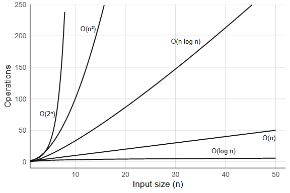

# Complexity and algorithms {#sec-complexity}

```{r}
#| include: false
source(here::here("_common.R"))
```

You write a loop that takes three seconds on your test data. You deploy it on the full dataset, ten times larger, and it takes five minutes instead of the thirty seconds you expected. You double-check the code; nothing has changed, nothing is obviously wrong. The loop is doing the same thing it did before, just on more rows. So why did a 10x increase in data produce a 100x increase in running time?

The answer is in the *shape* of the growth: how running time scales with input size\index{time complexity}\index{space complexity}. Some operations cost the same on ten rows as on ten million, some cost ten times more, and some, like the loop above, cost a hundred times more. This chapter is about telling those apart before the full dataset does it for you.


## Not all operations are equal {#sec-why-speed-shape}

Consider two ways to find a value in a vector. `x[5]` jumps directly to the fifth memory address, regardless of how long the vector is. `which(x == 5)` checks every element one by one until it finds a match. For a vector of length 10, you would not notice the difference. For a vector of length 10 million, you would.

The first operation costs the same whether the vector has ten elements or ten billion. The second does twice the work on twice the data. That relationship, between the size of the input and the amount of work, is what computational complexity measures.


## Big-O notation {#sec-big-o}

An operation that touches every element of a vector of length n might take 3n² + 100n + 7 steps, and no two machines agree on how long a step takes. What survives from one machine to the next is the leading term: double n and the n² part quadruples, whatever the constants are. Big-O notation\index{Big-O notation} keeps only that: we say f(n) is O(g(n)) if, past some input size, f grows no faster than a constant multiple of g, so 3n² + 100n + 7 is simply O(n²).

The constants still matter in practice (a factor of 10 is still a factor of 10). Big-O captures the shape of growth, and that shape dominates once n gets large enough. When n is small, the constant factors dominate instead, and the algorithm with less overhead wins regardless of its Big-O.

### Common complexity classes

`length(x)` returns instantly on any vector, because R stores the length as an attribute and never counts the elements. Indexing by position, `x[5]`, computes a memory offset and jumps to it. Operations like these are O(1)\index{O(1)}, constant time: the same cost regardless of input size. A less obvious O(1) operation, and a more interesting one, is hash table lookup, which gets its own section below (@sec-hash-tables).

`findInterval(0.5, sorted_x)` finds where 0.5 falls in a sorted vector by splitting the vector in half, deciding which half holds the answer, and splitting again. On a million elements that takes about 20 comparisons; on a billion, about 30. This is binary search\index{binary search}, and its cost is O(log n), logarithmic time, which grows so slowly it barely registers.

`sum(x)` walks the entire vector, adding each element: one pass, n additions. `which(x > 0)` also scans every element once, selecting those that match. These are O(n)\index{O(n)}, linear time, and linear is often the best you can do, because you need to at least *read* all the input.

`sort(x)` costs more than a single pass but much less than you might guess: sorting a million numbers takes about 20 times the work of summing them. Sorting by comparing pairs of elements is O(n log n)\index{O(n log n)}, and the n log n shape is the price of comparison sorting.

::: {.callout-note collapse="true"}
## Can sorting beat n log n?
For comparison-based sorting, no. A decision-tree argument shows that any algorithm which sorts by comparing pairs of elements must make at least O(n log n) comparisons in the worst case. Radix sort sidesteps the bound by never comparing elements: it distributes them into buckets by digit, which is O(n) but only works when the keys have bounded range (integers, fixed-length strings). R's `sort()` uses radix for most vectors, as @sec-common-algorithms describes.
:::

Growing a vector with `c()` is the classic R example of the next class:

```{r}
#| eval: false
# Each c() call copies the entire existing vector
result <- c()
for (i in seq_len(n)) {
  result <- c(result, i)  # copies 1, then 2, then 3, ... elements
}
# Total copies: 1 + 2 + ... + n = n(n+1)/2 = O(n^2)
```

Each iteration copies everything accumulated so far, so the total work is 1 + 2 + ... + n. That is O(n²)\index{O(n squared)}, quadratic time, and it is the shape behind the loop in the opening: ten times the rows, a hundred times the copying. Any nested loop where both loops run over the input is quadratic, and so is a naive distance matrix, which computes n(n-1)/2 pairwise distances for n points. @sec-performance revisits the `c()` bottleneck in detail.

::: {.callout-note collapse="true"}
## Amortized O(1): the doubling strategy
Appending can be made cheap. Python's `list.append` allocates double the space whenever the array fills up; most appends then write to the next free slot in O(1), and the occasional O(n) resize happens rarely enough that the average cost per append stays constant. This is called O(1) *amortized*. R's `c()` allocates a fresh vector every time, which is why pre-allocation matters in R.
:::

Enumerating every subset of a set is the last class you will meet in practice. A set of n elements has 2^n subsets: at n = 20 that is about a million, at n = 30 a billion, at n = 50 over a quadrillion. Algorithms that grow as O(2^n), exponential time, are unusable for large inputs, and no constant-factor trick will save them.

{#fig-bigo-curves width=100%}

### How to tell empirically

The simplest test: double n and see what happens to the time. If the time roughly doubles, you have O(n); if it roughly quadruples, O(n²). Try this with `sum(rnorm(n))` (linear) versus the `c()` growth loop (quadratic) for n = 1000, 2000, 5000, 10000. The ratio test works because Big-O captures the exponent, and doubling the input raises a power-law relationship to the surface. What happens when the ratio is somewhere between 2 and 4? A ratio near 2.8 when you double n suggests O(n^1.5), and in general a ratio of r implies a growth exponent of log2(r). You can also fit a log-log regression: plot log(time) against log(n), and the slope estimates the exponent directly.

### Exercises {.unnumbered}

1. What is the Big-O complexity of `rev(x)` for a vector of length n? Why?
2. You have a sorted vector of length n. Compare the time of `x[1]` (get the minimum) versus `min(x)` (scan for the minimum). What are their complexities?
3. The function `outer(x, y, "-")` computes all pairwise differences between two vectors. If both have length n, what is the complexity in time and space?


## Hash tables: O(1) lookup from scratch {#sec-hash-tables}

Suppose you have a list of 10,000 names and you need to check whether `"beta"` is among them. The naive approach scans the list from the beginning, comparing each entry, and on average you check half the entries before finding a match (or all of them if the name isn't there). That is O(n).

If the list is sorted, binary search gets you to O(log n). But there is a way to get O(1), constant time, regardless of how many names are in the list.

Start by turning each name into a number. Summing the character codes of the letters will do for now:

```{r}
simple_hash <- function(key, n_slots) {
  codes <- utf8ToInt(key)
  (sum(codes) %% n_slots) + 1   # map to a slot between 1 and n_slots
}

simple_hash("beta", 10)
simple_hash("gamma", 10)
simple_hash("alpha", 10)
```

Each name now maps to a slot between 1 and 10. Allocate an array with 10 slots. To store `"beta" = 2`, compute `simple_hash("beta", 10)` and put the value in that slot; to look it up later, compute the same hash, jump directly to that slot, and read the value. No scanning. A function that turns a key into a slot number this way is a *hash function*\index{hash table}, and it converts a search problem into an arithmetic problem.

```{r}
# Build a hash table by hand
n_slots <- 10
slots <- vector("list", n_slots)

# Insert three key-value pairs
insert <- function(slots, key, value, n_slots) {
  i <- simple_hash(key, n_slots)
  slots[[i]] <- list(key = key, value = value)
  slots
}

slots <- insert(slots, "alpha", 1, n_slots)
slots <- insert(slots, "beta",  2, n_slots)
slots <- insert(slots, "gamma", 3, n_slots)

# Look up "beta": one hash computation, one slot access
lookup <- function(slots, key, n_slots) {
  i <- simple_hash(key, n_slots)
  if (!is.null(slots[[i]])) slots[[i]]$value else NA
}

lookup(slots, "beta", n_slots)
```

One hash computation, one array access, O(1).

Now hash two names that happen to use the same letters:

```{r}
simple_hash("ab", 10)
simple_hash("ba", 10)
```

Same slot. Two different keys landing on one slot is a *collision*, and `simple_hash` invites them, since any two strings with the same character-code sum collide. When that happens the slot has to hold more than one entry. The standard fix is *chaining*: each slot stores a list of key-value pairs, and lookup hashes to the slot, then scans the short list:

```{r}
# A hash table with chaining
insert_chain <- function(slots, key, value, n_slots) {
  i <- simple_hash(key, n_slots)
  slots[[i]] <- c(slots[[i]], list(list(key = key, value = value)))
  slots
}

lookup_chain <- function(slots, key, n_slots) {
  i <- simple_hash(key, n_slots)
  chain <- slots[[i]]
  for (entry in chain) {
    if (entry$key == key) return(entry$value)
  }
  NA
}

slots2 <- vector("list", 10)
slots2 <- insert_chain(slots2, "alpha", 1, 10)
slots2 <- insert_chain(slots2, "beta",  2, 10)
slots2 <- insert_chain(slots2, "gamma", 3, 10)

lookup_chain(slots2, "beta", 10)
lookup_chain(slots2, "missing", 10)
```

In the worst case, every key hashes to the same slot, the chain has n entries, and lookup degrades to O(n). But a good hash function distributes keys evenly across slots, keeping each chain short: with n keys and n slots, the average chain length is 1, and lookup is O(1) on average.

R uses exactly this mechanism for environments. Every environment is a hash table mapping names to values, so when you write `e$beta`, R hashes the string `"beta"`, jumps to the right slot, and returns the value. This is also why `match()`, `duplicated()`, `%in%`, `unique()`, and `table()` are fast: they build a temporary hash table internally, making membership tests O(1) per query instead of O(n).

```{r}
# R environments are hash tables
e <- new.env(hash = TRUE, parent = emptyenv())
e$alpha <- 1
e$beta  <- 2
e$gamma <- 3

# This does NOT scan through "alpha" first.
# The hash of "beta" points directly to the right slot.
e$beta
```

The constant in O(1) depends on the hash function's speed and the collision rate. Real hash functions (R uses one internally for its environments) are more sophisticated than summing character codes, distributing keys more uniformly and handling edge cases. But the principle is always the same: convert the key to an integer, use it as an index, handle collisions with chaining.

What happens when the table fills up? The chains get longer, and lookup degrades toward O(n). Real hash tables track the *load factor* (number of entries divided by number of slots) and resize, typically doubling the slot count, when it crosses a threshold (often 0.75). Resizing costs O(n) because every key must be rehashed into the new array, but it happens rarely enough that the amortized cost per insertion stays O(1).

### Exercises {.unnumbered}

1. Find two keys other than `"ab"` and `"ba"` that collide under `simple_hash` with 10 slots. Insert both into `slots2` with `insert_chain()` and confirm that `lookup_chain()` still returns the right value for each.
2. Our hand-built hash table has a fixed number of slots. What happens as you insert many more keys than slots? How does the average chain length change? (This is why real hash tables *resize*: when the load factor exceeds a threshold, they allocate a larger array and rehash all keys.)
3. Use `system.time()` to compare `x %in% y` versus a loop with `any(y == x[i])` for `x <- sample(1e6)` and `y <- sample(1e4)`. The first builds a hash table; the second does linear scans.


## Space complexity {#sec-space-complexity}

Memory scales too. A slow loop finishes eventually; a session that runs out of RAM ends. A full copy of a 1 GB data frame uses 1 GB of additional memory, and two copies put you at 3 GB total. R's garbage collector reclaims memory nothing refers to any more, but while several large objects are live at once, they all count. So when does R copy?

### Copy-on-modify

```{r}
x <- rnorm(1e6)
y <- x              # no copy yet: x and y share the same memory
y[1] <- 0           # NOW R copies the entire vector, then modifies element 1
```

Assigning `x` to `y` copies nothing; both names point at the same data. The copy happens at `y[1] <- 0`, the moment one of them is modified. This is the copy-on-modify\index{copy-on-modify} from @sec-names-binding, seen from the memory side, and you can verify it with `lobstr::obj_addr()`:

```{r}
#| eval: false
library(lobstr)
x <- rnorm(1e6)
y <- x
obj_addr(x) == obj_addr(y)  # TRUE: same memory

y[1] <- 0
obj_addr(x) == obj_addr(y)  # FALSE: y is now a separate copy
```

Copy-on-modify is why passing large objects to functions is cheap in R: the function receives a reference, not a copy, and a copy happens only if the function modifies the object. But when modification *does* happen (say, inside a loop) the cost can compound quickly, turning what looks like an O(n) operation into something much worse.

### Pre-allocation vs. growing

The `c()` loop from the quadratic example above is slow in time and wasteful in memory. Each iteration allocates a new vector of size i, copies the old data, and discards the old allocation, so the total memory allocated across all iterations is 1 + 2 + 3 + ... + n = O(n²), even though the final result uses only O(n) space.

Pre-allocation fixes both problems:

```{r}
#| eval: false
# O(n²) total memory allocated
result <- c()
for (i in seq_len(n)) result <- c(result, i)

# O(n) total memory allocated
result <- numeric(n)
for (i in seq_len(n)) result[i] <- i
```

### Measuring memory

```{r}
x <- rnorm(1e6)
object.size(x)
```

`object.size()` gives a rough estimate. For more accurate measurements, including shared memory between objects:

```{r}
#| eval: false
lobstr::obj_size(x)

# Shared memory: two references to the same object
y <- x
lobstr::obj_size(x, y)  # same as obj_size(x), not double
```

Some vectors take far less memory than their length suggests:

```{r}
lobstr::obj_size(1:1e7)
lobstr::obj_size(sample(1:1e7))
```

Same ten million integers, and the shuffled copy takes sixty thousand times the space. R stores `1:1e7` as a start, an end, and a step, and only expands it when something needs the actual elements; the shuffle has no such description. (`object.size()` reports the expanded size for both.)

::: {.callout-note collapse="true"}
## Kolmogorov complexity
The compact sequence is a small case of a general idea: the amount of information in an object is the length of the shortest program that produces it. `rep(1, 1e6)` is a million elements that a few bytes describe; a million draws from `rnorm()` have no shorter description than themselves. This quantity is called Kolmogorov complexity, it is uncomputable in general (a consequence of the halting problem in @sec-halting-problem), and compression algorithms approximate it from above.
:::

### Exercises {.unnumbered}

1. Create a list of 10 data frames, each with 1000 rows and 5 columns. Use `lobstr::obj_size()` to measure the total. Is it 10 times the size of one data frame?
2. `x <- 1:1e7` is compact. Which of `x + 0L`, `as.numeric(x)`, and `rev(x)` keep it compact? Check each with `lobstr::obj_size()`.
3. Write a function that takes a data frame and returns it unchanged. Use `lobstr::obj_addr()` to verify that no copy is made.


## Common algorithms in R {#sec-common-algorithms}

You rarely implement algorithms from scratch in R, but the built-in functions make algorithmic choices on your behalf, and knowing what they chose helps you predict when they will be fast and when they will not.

### Sorting

`sort()` picks its algorithm by the type and length of the input. For numeric, integer, and logical vectors and factors shorter than 2^31^ elements, which covers nearly everything you will sort, it uses a radix sort, the O(n) bucket method from the callout in @sec-big-o; the implementation was contributed by the authors of the data.table package. Anything else falls back to Shellsort, and `method = "quick"` is available on request. `?sort` lists the rules.

`order()` returns the permutation that would sort the vector, with the same choice of algorithm, and for data frames it is the basis of `dplyr::arrange()`.

### Searching and matching

`match()` and `%in%` build a hash table from one vector, then probe it for each element of the other. Building the table is O(n); each lookup is O(1) on average, so `x %in% y` is O(n + m) where n and m are the lengths of `x` and `y`.

`findInterval()` does binary search on a sorted vector: O(log n) per query. If you have many queries against the same sorted vector, `findInterval` can be faster than building a hash table, because the sorted structure is already there and hashing has overhead.

### Hashing

`duplicated()`, `unique()`, and `table()` all use hash tables internally. That is why `duplicated(x)` is O(n), not the O(n²) you would get from comparing every pair of elements.

### String matching

`grep()` and `grepl()` compile the pattern into a finite automaton, then scan the input strings. For fixed strings, `fixed = TRUE` skips regex compilation entirely:

```{r}
#| eval: false
# Regex: compiles pattern, then scans
grep("item_5", x)

# Fixed string: faster, no regex overhead
grep("item_5", x, fixed = TRUE)
```

For repeated matching against the same pattern, pre-compiling with `stringi::stri_detect_regex()` avoids recompilation.

### Exercises {.unnumbered}

1. You need to check whether each element of a vector `x` (length 1 million) appears in a lookup table `y` (length 100). Compare `x %in% y` with a loop using `any(y == x[i])`. What are their complexities?
2. Why is `duplicated(x)` faster than `length(unique(x)) < length(x)` for simply checking whether duplicates exist? (Hint: `duplicated` can short-circuit in principle, though R's implementation does not.)
3. You have a sorted numeric vector of length 10 million. You need to find where 1000 query values fall. Compare `findInterval(queries, sorted_vec)` with `match(queries, sorted_vec)`. Which is appropriate here, and why?


## Computability {#sec-computability}

Everything above assumes the problem *can* be solved, that some algorithm exists, however slow, that will eventually produce the answer. Not all problems have that property.

### The halting problem {#sec-halting-problem}

By the early twentieth century, mathematicians had been on a winning streak that stretched back decades. Cantor had tamed infinity. Frege had formalized logic. Peano had reduced arithmetic to five axioms. Every time someone asked "can we make this rigorous?" the answer had been yes.

David Hilbert had watched this happen for thirty years, and in 1928 he posed the question that felt like the natural finish line: the *Entscheidungsproblem*\index{Entscheidungsproblem}, the decision problem. Could you build a mechanical procedure that takes any mathematical statement and tells you whether it is true or false? If such a procedure existed, mathematical truth would be computable. Every conjecture decidable, every proof checkable by turning a crank, but then in 1936 a twenty-three-year-old graduate student would shock the whole mathematical worldview.

He proved that no algorithm\index{algorithm} can decide, for an arbitrary program and input, whether that program will eventually halt or run forever\index{halting problem}. It was Alan Turing, the same graduate student whose tape machine we met in @sec-turing, now proving that his own machine had a boundary it could never cross.

The specific question he settled is called the *halting problem*. The proof fits in half a page, and it is given here in full, in R.

**The proof by contradiction.** Assume, for the sake of contradiction, that a function `halts(f, x)` exists. It takes any function `f` and any input `x`, and returns `TRUE` if `f(x)` terminates, `FALSE` if `f(x)` runs forever. It always returns one or the other; it never crashes or loops itself. That is the assumption we will break.

Given `halts`, define a new function:

```{r}
#| eval: false
trouble <- function(x) {
  if (halts(trouble, x)) {
    while (TRUE) {}   # loop forever
  } else {
    return(x)          # halt
  }
}
```

Now ask: does `trouble(trouble)` halt?

**Case 1:** Suppose `halts(trouble, trouble)` returns `TRUE`. Then `trouble(trouble)` enters the `if` branch and loops forever. But `halts` said it would halt. Contradiction.

**Case 2:** Suppose `halts(trouble, trouble)` returns `FALSE`. Then `trouble(trouble)` enters the `else` branch and returns `trouble`. It halts. But `halts` said it would not. Contradiction.

Both cases contradict the assumption, and there is no third case (we assumed `halts` always returns `TRUE` or `FALSE`). Therefore `halts` cannot exist. No algorithm, in any language, can solve the halting problem for arbitrary programs\index{undecidable}.

The argument is a *diagonal argument*, the same technique Cantor used in 1891 to prove that the real numbers are uncountable, and the same structure Gödel used in 1931 for the incompleteness theorems. The trick is always the same: assume a complete listing (or decision procedure) exists, then construct something that disagrees with every entry on the diagonal.

The step that breaks `halts` is `trouble(trouble)`: a function handed itself as an argument. Nothing in R forbids that. Functions are values, values can be passed to functions, and `sapply(fs, \(f) f(f))` is legal R. Closures, recursion, and higher-order functions all depend on that freedom, and the halting problem is its price: any language that lets a function receive itself is expressive enough to build `trouble`. When a linter warns about unreachable code or an optimizer removes dead branches, it is working inside this limit, necessarily incomplete, always capable of missing something.

::: {.callout-note collapse="true"}
## The same proof in lambda calculus

Church reached the same result a few months before Turing, in April 1936, using the lambda calculus rather than a machine, and seeing his version shows that undecidability owes nothing to loops or mutable state. It falls out of self-application alone.

In lambda calculus, every value is a function and every computation is function application. There are no loops; non-termination means a term *reduces forever* without reaching a normal form. For instance, the term (λx. x x)(λx. x x) applies itself to itself, producing the same term again, endlessly, never halting. This term is called Ω.

Church's question: is there a lambda term H that, given any term M, returns `true` if M has a normal form (halts) and `false` if M reduces forever?

Assume H exists. Define:

```
D = λm. if (H (m m)) then Ω else I
```

where Ω is the non-terminating term from above and I = λx. x is the identity (which halts immediately). Now apply D to itself:

- If H(D D) returns `true` (meaning D D halts), then D D reduces to Ω and loops forever. Contradiction.
- If H(D D) returns `false` (meaning D D diverges), then D D reduces to I and halts. Contradiction.

Same diagonal structure, same conclusion: H cannot exist. No lambda term can decide whether an arbitrary term has a normal form. Church's paper was "An Unsolvable Problem of Elementary Number Theory"; Turing's, that November, was "On Computable Numbers".
:::

**Why it matters in practice.** Rice's theorem\index{Rice's theorem} (1953) generalizes the result: *any* non-trivial semantic property of programs is undecidable. You cannot write a program that decides whether another program is "correct," "efficient," or "pure." Tools like lintr and mypy use sound overapproximations, rejecting some correct programs to guarantee they never accept an incorrect one. Every analyzer has blind spots; the design decision is where to put them.

### Practical workarounds

You cannot solve the halting problem in general, but you can set time limits:

```{r}
#| eval: false
# setTimeLimit: kill a computation after 5 seconds
setTimeLimit(elapsed = 5, transient = TRUE)
tryCatch(
  {
    # potentially non-terminating computation
    result <- some_function(x)
  },
  error = function(e) message("Computation timed out")
)
setTimeLimit(elapsed = Inf)  # reset
```

The R package `R.utils` provides `withTimeout()` for a cleaner interface. These are engineering solutions to a mathematically unsolvable problem: you cannot know whether the computation will finish, but you can decide how long you are willing to wait.

### The Church-Turing thesis

Two proofs of the same boundary, from two models that look nothing alike, raised the question of whether the models themselves were equivalent. Church and Turing showed that they were: lambda calculus and Turing machines compute exactly the same class of functions, the result @sec-church introduced as the *Church-Turing thesis*\index{Church-Turing thesis}. The thesis goes one step further and states that any function computable by an effective procedure at all can be computed by a Turing machine, or equivalently, expressed as a lambda term.

This has a concrete consequence: R, Python, C, Haskell, and every other general-purpose language can compute exactly the same set of functions. No language can solve the halting problem; no language can compute a function that another general-purpose language cannot. The differences between languages are speed, expressiveness, and safety, not computational power. R's functions, closures, and recursion descend from the lambda calculus and C's loops descend from the machine, and the equivalence makes them two notations for the same set of computations.

### P vs NP

Some problems are easy to *verify* but (probably) hard to *solve*. Given a proposed solution to the traveling salesman problem, you can check its total distance in O(n), but finding the optimal solution appears to require exponential time.

The class **P** contains problems solvable in polynomial time; the class **NP** contains problems whose solutions can be *verified* in polynomial time. Whether P = NP\index{P vs NP} is the most famous open question in computer science, and most researchers believe P ≠ NP, which would mean some problems are fundamentally harder to solve than to check.

The subset sum problem makes the gap concrete. Given a set of integers, does any subset sum to a target value? Verifying a proposed subset is O(n), just add the numbers. Finding one by brute force means checking all 2^n subsets:

```{r}
#| eval: false
# Brute force: check all 2^n subsets (exponential)
subset_sum_brute <- function(x, target) {
  n <- length(x)
  for (i in seq_len(2^n) - 1) {
    bits <- as.logical(intToBits(i)[seq_len(n)])
    if (sum(x[bits]) == target) return(x[bits])
  }
  NULL
}

# A greedy approximation: sort descending, take what fits (polynomial)
subset_sum_greedy <- function(x, target) {
  x <- sort(x, decreasing = TRUE)
  picked <- logical(length(x))
  remaining <- target
  for (i in seq_along(x)) {
    if (x[i] <= remaining) {
      picked[i] <- TRUE
      remaining <- remaining - x[i]
    }
  }
  if (remaining == 0) x[picked] else NULL
}
```

At n = 20 the brute-force version checks about a million subsets and finishes in under a second. At n = 40 it checks a trillion, and you will not wait long enough. The greedy version runs in O(n log n) on either input but can miss a solution that exists. That is the P-vs-NP gap in miniature: polynomial verification, (apparently) exponential search, and a fast heuristic that is sometimes wrong.

In practice, R encounters NP-hard\index{NP-hard} problems in optimization. `optim()` does not guarantee a global optimum for non-convex problems; it uses heuristic methods (Nelder-Mead, simulated annealing) that find good-enough solutions without exhaustive search. This is the pragmatic response to intractability: give up on perfection and settle for "good enough, fast."

The loop from the opening, the one that took five minutes instead of thirty seconds, had an O(n²) operation hiding inside what looked like O(n) code, most likely a `c()` or an `rbind()` growing a result one row at a time. The 10x increase in data exposed a quadratic shape that small test sets had concealed, and faster hardware would only have postponed the moment. The next chapter turns from how much work a computation does to what it works on: so far the only container you have is the atomic vector, which insists that everything inside it be the same type.

### Exercises {.unnumbered}

1. Write a function that takes another function `f` and an argument `x`, calls `f(x)` with a 2-second time limit, and returns `NA` if the computation does not finish.
2. Can a program determine whether a given R function is pure (no side effects)? Why or why not?
3. Is sorting in P or NP? What about finding the shortest path that visits all cities exactly once (traveling salesman)?
