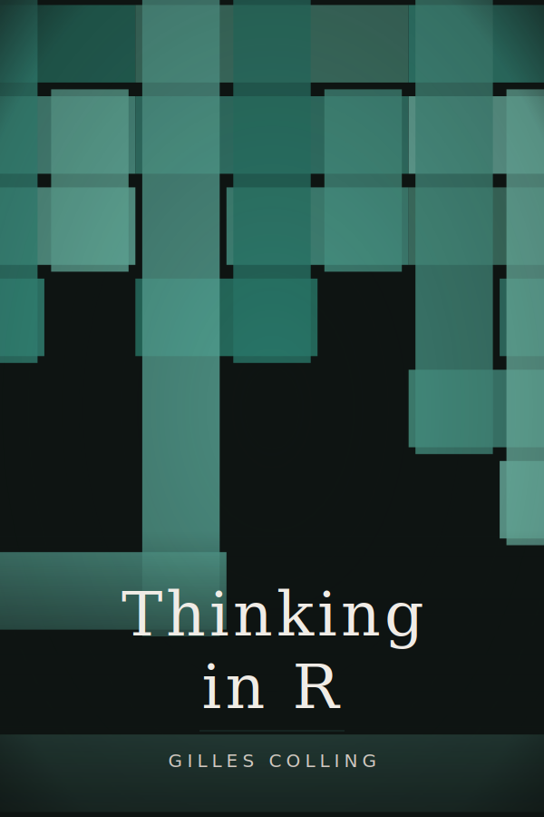

# Preface {.unnumbered}

::: {.content-visible when-format="html"}
*Last updated: *

<div class="book-cover-hero">
  
  <p class="buy-link">Print edition coming soon</p>
  <a class="buy-coffee" href="https://buymeacoffee.com/gcol33">Buy me a coffee</a>
</div>
:::

This is the website for **Thinking in R**.

R descends from the lambda calculus, by way of Scheme and a Bell Labs language called S. That ancestry shaped every part of the language. All of it traces back to a single design decision made in the 1970s.

You'll learn R from scratch: how to store and manipulate data, write your own functions, transform messy tables into clean results, and build visualizations. You'll also learn *why* R works the way it does. By the end, you'll understand functional programming, know how to work with real data, and see ideas (closures, composition, immutability) that show up in every modern language. No prior programming experience is required.

### Who this book is for

R beginners who want to understand the language properly will find the full path here. Intermediate R users who learned the tidyverse first and want to fill in the foundational layer underneath it will find it too. Programmers coming from Python, JavaScript, or another language who need to pick up R will see how it connects to ideas they already know. The book assumes you are comfortable with a text editor and a terminal; it does not teach those from zero.

### How the book is organized

The book has five parts. Part I (Chapters 1--9) builds the foundations: expressions, vectors, functions, control flow, and algorithmic thinking. Part II (Chapters 10--17) covers data; lists, data frames, strings, reading files, transformation with dplyr, tidy data, and visualization with ggplot2. Part III (Chapters 18--23) covers closures, higher-order functions, map/reduce, recursion, and lazy evaluation. Part IV (Chapters 24--27) introduces the type system; S3, S7, defensive coding, metaprogramming, and building a small DSL. Part V (Chapters 28--33) covers performance, R internals, connecting to other languages, package development, and reproducible workflows.

### Setup

You need two things installed: R itself and an editor.

1. Install R from <https://cran.r-project.org/> (download the version for your operating system).
2. Install [RStudio Desktop](https://posit.co/download/rstudio-desktop/) (free) or use [VS Code](https://code.visualstudio.com/) with the R extension.

The book uses base R throughout; several chapters also use tidyverse packages. Install them once by running in the R console:

```r
install.packages("tidyverse")
```

This book is free and open source, licensed under [CC BY-NC-SA 4.0](https://creativecommons.org/licenses/by-nc-sa/4.0/). The source code is available on [GitHub](https://github.com/gcol33/thinking-in-r).

### Citation

To cite this book:

<div class="citation-box">
  <p class="citation-text">Colling G (2026). Thinking in R: A Free, Open-Source Introduction to R Programming. doi: 10.5281/zenodo.18918794. https://gillescolling.com/thinking-in-r/</p>
  <button class="copy-btn" aria-label="Copy citation"><svg xmlns="http://www.w3.org/2000/svg" width="16" height="16" viewBox="0 0 24 24" fill="none" stroke="currentColor" stroke-width="2" stroke-linecap="round" stroke-linejoin="round"><rect x="9" y="9" width="13" height="13" rx="2" ry="2"/><path d="M5 15H4a2 2 0 0 1-2-2V4a2 2 0 0 1 2-2h9a2 2 0 0 1 2 2v1"/></svg></button>
</div>

